# BPSRAssist
 

**BPSRAssist** is a real-time DPS tracker for *Blue Protocol: Star Resonance*. It seamlessly provides live combat statistics and performance data directly to your screen via a customizable floating overlay.

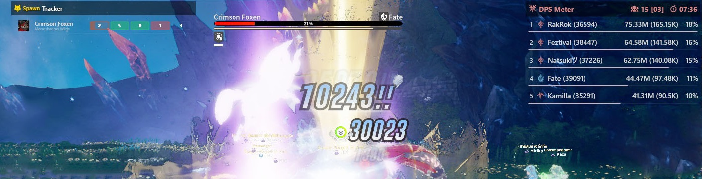

---

## 🌟 Key Features

- **⚔️ DPS Meter:** Real-time metrics for DPS, Healer, and Tank.
- **📊 Deep Skill Breakdown:** In-depth logs with performance graphs.
- **🤖 Module Optimizer:** Calculates optimal module combinations for your setup.
- **🐺 Spawn Tracker:** Real-time boss and magical creature timers with line tracking.
- **📈 Performance Monitor:** Live FPS and hardware usage monitoring.
- **🎨 Customizable Overlay:** Toggle widgets, adjust background opacity, and set global hotkeys.

---

## 📸 Screenshots

### 📊 Combat Analytics
| Main DPS Meter | Detailed Skill Breakdown |
|:---:|:---:|
| 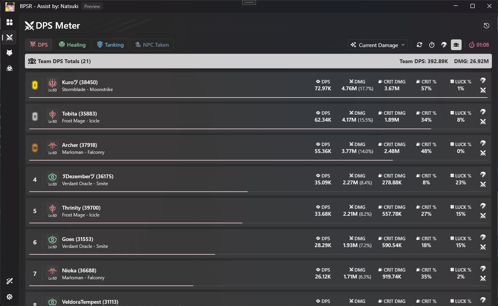 | 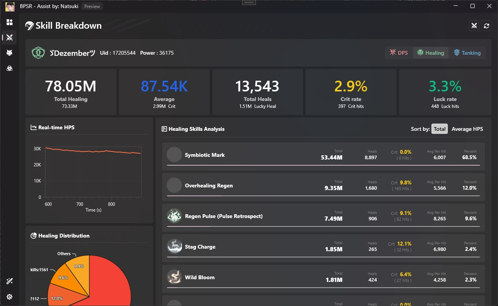 |

### 🛠️ Tools & Utility
| Module Optimizer | Spawn Tracker |
|:---:|:---:|
| 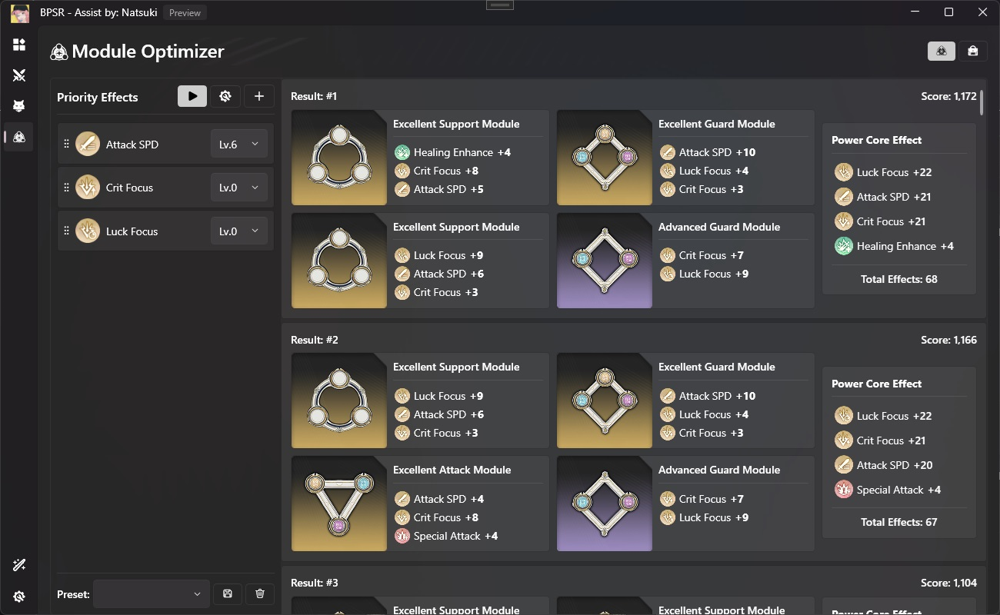 | 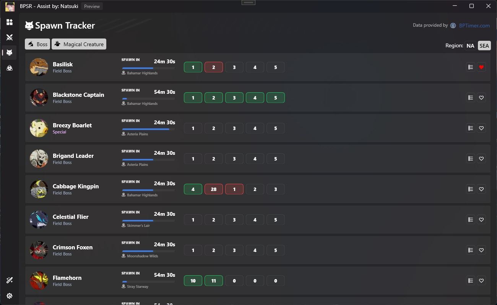 |

### 🛠️ Settings
| Game Overlay Settings | Main Settings |
|:---:|:---:|
| 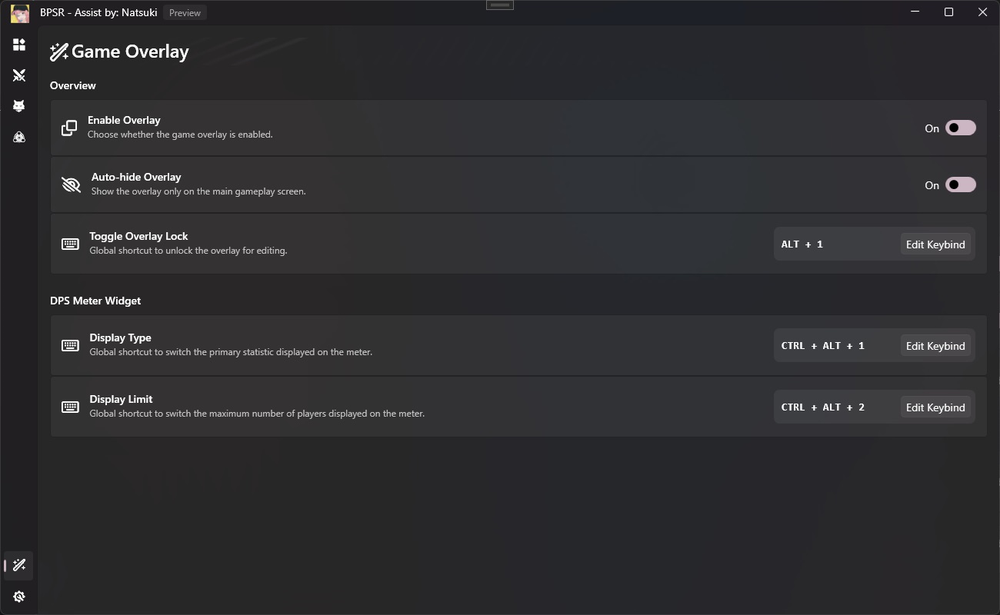 | 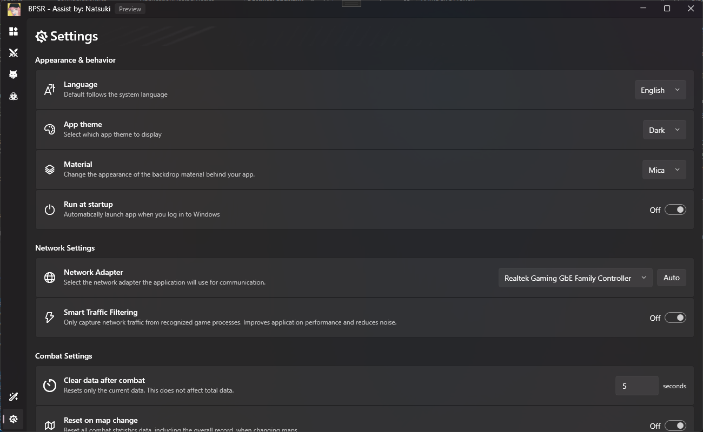 |

### 🎮 In-Game Widgets
| DPS Meter Widget | Skill Log Widget | Spawn Tracker Widget | Performance Widget |
|:---:|:---:|:---:|:---:|
| 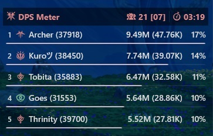 | 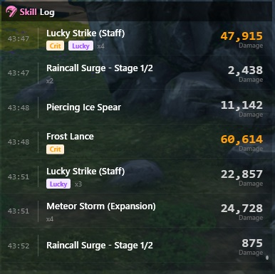 | 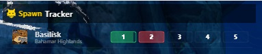 | 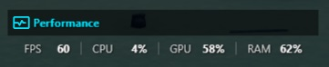 |

### ⚙️ Control Bar & Customization
| Overlay Toolbar | DPS Meter Settings | Performance Settings |
|:---:|:---:|:---:|
| 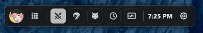 | 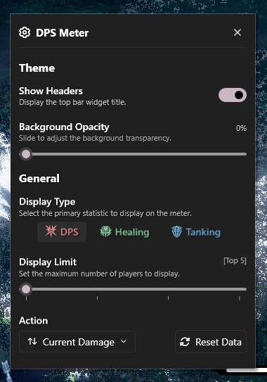 | 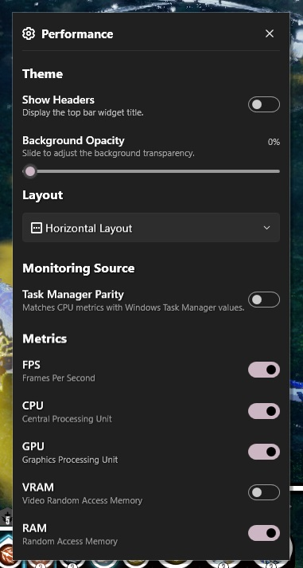 |

---

## 🚀 Quick Start

### Requirements
- **[Npcap](https://npcap.com/#download)** – Required for packet capture.  
  *(Crucial: Install with "WinPcap API-compatible Mode" enabled)*
- **[.NET 9 SDK](https://dotnet.microsoft.com/en-us/download/dotnet/9.0)**
- Windows 10 or later

### Installation
1. Download the latest installer from the [Releases](../../releases) page.
2. Run the installer and follow the prompts.
3. Launch BPSRAssist. (Run as Administrator if data capture doesn't start automatically).

---

## ❤️ Acknowledgments
- **Star Resonance Toolbox:** For the original project base: [StarResonanceDps](https://github.com/anying1073/StarResonanceDps)
- **bptimer.com:** For providing live HP-by-line data: [https://bptimer.com](https://bptimer.com)
- **ZDPS project:** For technical insights and protocol mapping: [BPSR-ZDPS](https://github.com/Blue-Protocol-Source/BPSR-ZDPS)

---

### 🛠️ Development Note
> [!NOTE]
> **BPSRAssist** is currently in its **Preview Version**. The source code is undergoing refactoring and will be made public once the project reaches a more stable milestone. Stay tuned!

---

**Author:** Natsuki  
